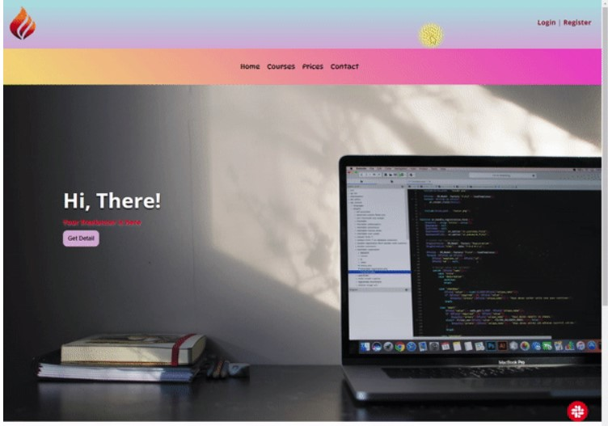

# Description
The project aims to create a sticky-enabled website.

## Objective
At the end of the project, following topics are to be covered;
* HTML
* List Properties
* Overflow Property-The float Property-Opacity / Transparency-Units in CSS
* CSS Setting height and width-CSS Outline-CSS Combinators

At the end of the project, students will be able to;
* improve coding skills within HTML & CSS
* use git commands (push, pull, commit, add etc.) and Github as Version Control System.

-----

### Project Skeleton:

```
    WebSite_Sticky (folder)
    |
    |----Readme.md        
    |----img (Images of the project)   
    |----solution
            |----index.html  
            |----style.css   
            |----images
                   |---- *.jpg
                   |---- *.png

```
### Project View:




> Designed By DOGUKAN © Jan 2024